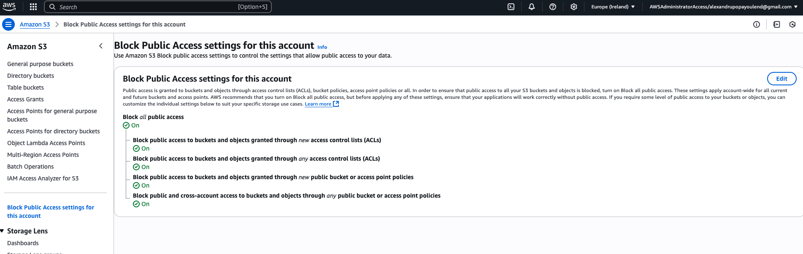

# Global Customizations

This repo stores the Terraform and API helpers for the Global Customizations. Global Customizations are used to customize all provisioned accounts with customer defined resources. The resources can be created through Terraform or through Python, leveraging the API helpers. The customization run is parameterized at runtime.

Terraform structure:

```
AFT/
└── tf-aws-ct-aft-workshop-global-customizations/
    ├── api_helpers/
    └── terraform/
        ├── aft-providers.jinja
        ├── backend.jinja
        ├── main.tf
        └── README.md
    ├── .gitignore
    ├── LICENSE
    └── README.md
```

For this example we will use a simple enable BPA at account level in `main.tf`:

```hcl
resource "aws_s3_account_public_access_block" "block_all_public" {
  block_public_acls       = true
  block_public_policy     = true
  ignore_public_acls      = true
  restrict_public_buckets = true
}
```

